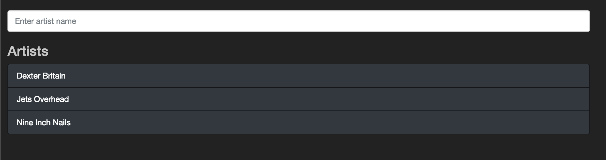
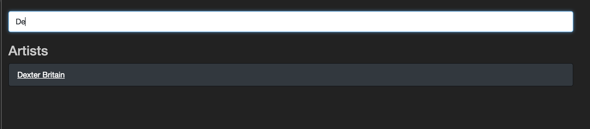
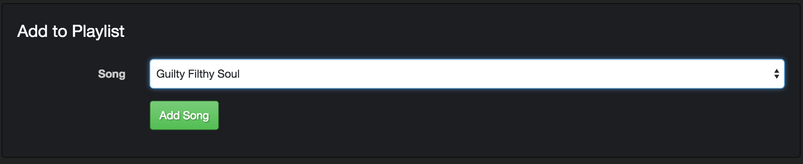

# React III

## Intro

### Forms & Inputs

Software interactivo tiene input del usuario. A medida que la web se hizo más interactiva, estos inputs se volvieron increiblemente poderosos. jQuery, por ejemplo, proveyó una normalización muy necesitada para lidear con muchos tipos de inputs a través de diferentes ambientes. En ese momento, eso alcanzo, pero el input del usuario a crecio a tantas proporciones que demanda un mayor nivel de organización y modularidad.

El problema principal es la sincronización de la data. ¿Cómo la data que el usuario provee se sincroniza con el backend, o incluso otras partes de la aplicación? Igual de difícil es la tarea de validar y manejar el estado de los formularios. ¿Es un campo invalido? ¿Ha sido editado? Si es así, ¿deberíamos mostrarle esto a el usuario?

### Objetivo

En la aventura de hoy, implementaremos playlists. Usuarios de la aplicación van a ser capaces de crear una playlist, buscar entre todas las playlists, ver una sola playlist, y agregar canciones a cualquier playlist. Vamos a aprender como lidear con inputs en React y manejar la data del form.

### Punto de Inicio

1. Forkea y clona [este repo](https://github.com/Plataforma5la/19_React_Workshop_III)
2. Corré `npm install`

## Filtro de Artistas

### App State vs UI State

Hasta ahora, hemos aguardado todo el estado de nuestra aplicación centralizado en el componente `Main`. Esto es importante porque nos permite fácilmente transportar el estado de nuestra aplicación a los distintos componenetes que lo necesitan, y tambien ayudan hacer que nuestro componentes tontos permanezcan bonitos y tontos. Sin embargo, algunas veces sabemos que algunos tipos de estado van a estar localizados en un area particular de nuestra app - estados como la data de un formulario, timers, pequeñas animaciones, etc. Sería una pena saturar ya el bastante ocupado componente `Main`con el estado de un solo input.

Algunos desarrolladores les gusta hacer la distinción entre lo que podríamos llamar el estado de nuestra aplicación (`app state`), o el estado que es central a nuestra app y puede estar disponible a varios componentes diferentes, y el estado de la interfaz de usuario(`UI state`) o estado local(`local state`) - este sería el estado en el que solo necesiamos manejar UI en un solo lugar - cosas como forms van a ser considerados normalmente como estado local.

Escribamos un componente que maneja estado local. Vamos a añadirle u feature a nuestro componente `Artists` que nos va a permitir comenzar a escribir el nombre de un artista en un input, y la lista de artistas se va a filtar para solo los artistas cullo nombre matchea la entrada

### Composición

El filter que escribamos se tiene que ver algo así:

#### Antes de typear algo en el



#### Luego de typear una entrada



Tu primer instinto puede ser ir y modificar el componente `Artist`. Sin embargo, el componente del artista ya hace su trabajo bastante bien: si le damos una `props.artists`, va a renderizar nuestra lista de artistas. ¿Por qué cambiarla?

En cambio, tomemos ventaja de la naturaleza funcional de react y hagamos una _composición_. Sabemos como se ve esto con funciones regulares para este punto:


```js
// la función addSomething es muy buena en sumar x e y
function addSomething (x, y) {
  return x + y;
}

// La función logSomething es muy buena en loggear z a la consola
function logSomething (z) {
  console.log(z);
}

// componenmos su funcionalidad a una sola función
function addAndLog (x, y) {
  logSomething(addSomething(x, y));
}
```

De la misma forma, vamos a escribir un nuevo componente con estado, que maneje el valor del input, filtre a los artistas del arreglo, y pase a los artistas filtrados al componente `Artist`.

### FilterableArtists

Crea un nuevo componente presentacional llamado `FilterInput` - agregalo al directorio `react/components/`:

```JSX
import React from 'react';

const FilterInput = (props) => {
  return (
    <form className="form-group" style={{marginTop: '20px'}}>
      <input
        className="form-control"
        placeholder="Enter artist name"   
      />
    </form>
  );
}

export default FilterInput;
```
Ahora vamos a escribir nuestro primer nuevo componente contenedor (lease: "con estado") a nuestro directorio `react/containers/` - dale un nombre como `FilterableArtistsContainer.jsx`. Este componente con estado va a componer nuestro `FilterInput` y `Artists` juntos al manejar el estado del input form, y filtrando de la lista de artistas que le pasa a `Artists`.

**Pero primero**, aprendamos sobre el `SyntheticEvent` de React!

### SyntheticEvent

Cuando pasamos una función callback a un event listener como `onClick`, React va a pasar implicitamente un objeto `event` a el como primer argumento.

Sin embargo, React es bastante inteligente con este objeto. Porque diferentes browsers tienen la desafortunada tendencia de pasar distintos tipos de eventos, React envuelve el evento nativo del browser con una clase suya, llamada `SyntheticEvent. Podés acceder muchas de esos campos que haz visto antes cuando trabajamos con el DOM y jQuery, pero es un poco distinto (chequá los [docs](https://reactjs.org/docs/events.html) para más información).

La parte tricky de `SyntheticEvent` es que React agrupa todos los eventos al mismo objeto `SyntheticEvent`. Esto siginifica que `SyntheticEvent` es un solo objeto que React muta en el runtime. Esto es una gran victoria en performance, pero también significa que no podés usar el objeto event por si mismo asincrónicamente (el cual, no olvidemos, incluye `setState`). Esto significa que una vez que tenés el `SyntheticEvent`, deberías agarrar cualquier valor que necesites antes de acer algo async, de otra forma, vas a terminar un con un bug en tus manos.

Por ejemplo, si queremos tomar el valor del input, vamos a querer hacer algo así:

```js
// con seguridad tomamos el valor del string del event.target
this.setState({ inputValue: event.target.value });
```
**No querríamos** hacer algo como esto:

```js
// NO HAGAS ESTO
this.setState({ input: event });
```

Si hiceramos esto, para el momento que tratasemos de extraer el valor, probablemente se haya ido!

### Guía

Deberías estar equipado con el conocimiento que necesitas para implementar el filtro. Tratá de hacerlo por tu cuenta primero! Si te trabás o necesitas mayor dirección a través del proceso, aquí hay algunos pasos para guiarte:

1. En tu `Main.jsx`, en vez de renderizar `Artists` cuando la url es `/artists`, renderizá el `FilterableArtistsContainer`.

|||
```JSX
<Route path="/artists" exact render={() => <FilterableArtistsContainer artists={artists} />} />
```
|||

2. El `FilterableArtistsContainer` debería renderear ambos el `FilterInput` y el componente `Artists`.

|||
```JSX
// In FilterableArtistsContainer.js
render () {
  return (
    <div>
      <FilterInput />
      <Artists artists={/**TODO**/} />
    </div>
  )
}
```
|||

3. Pon un espacio en el estado del `FilterableArtistsContainer` para contener el valor actual entrado en el input

|||
```js
this.state = {
  inputValue: ''
};
```
|||

4. Escribe un método que vaya a coleccionar el valor del input cuando el input cambia y setealo el estado. Pasalo como una prop a `FilterInput` y daselo al listener apropiado.

|||
```JSX
// Escribe el método así en FilterableInputContainer.jsx:
handleChange (evt) {
  const value = evt.target.value;
  this.setState({
    inputValue: value
  });
}

render () {
  return (
    /** .... */
    <FilterInput handleChange={this.handleChange} />
    /** .... */
  )
}

// y luego agregalo asi en FilterInput.jsx:
<input onChange={props.handleChange} />
```
|||

5. En el método render de `FilterableArtistsContainer`, usa el valor del input para filtrar el arreglo de artistas para pasarle al componente `Artists`.


||| 

```JSX
render () {
  const inputValue = this.state.inputValue;
  const filteredArtists = this.props.artists.filter(artist =>
    artist.name.match(inputValue));
  return (
    /** ... */
    <Artists artists={filteredArtists} />
   /** ... */
  );
}
```
|||

## New Playlist

### New Playlist Component

1. Agrega el siguiente JSX a tu componente `Sidebar` (Justo por debaje del segundo par de `<section>`tags). Ese tag `<hr />`, si no estas familiarizado con él, es solo una linea horizonatal "horizontal rule" para separar tu `nav` del `button`

```JSX
<hr />
<section>
  <h4 className="text-muted">PLAYLISTS</h4>
  <h4>
    <Link className="btn btn-primary btn-block" to={/**todo!*/}>
      <span className="glyphicon glyphicon-plus"></span> PLAYLIST
    </Link>
  </h4>
</section>
```

2. Crea una `Route` y un componente presentacional para el `NewPlaylist`. La vista debería incluir un campo para entrar el nombre de la playlist, y también un botón para submitearla. Una vez que lo hayas hecho asegurate de `Link`ear ese "+ PLAYLIST" button para que nos navegue ahí.

+++JSX Posible
```JSX
const NewPlaylist = () => (
<div className="well">
  <form className="form-horizontal">
    <fieldset>
      <legend>New Playlist</legend>
      <div className="form-group">
        <label className="col-xs-2 control-label">Name</label>
        <div className="col-xs-10">
          <input className="form-control" type="text"/>
        </div>
      </div>
      <div className="form-group">
        <div className="col-xs-10 col-xs-offset-2">
          <button type="submit" className="btn btn-success">Create Playlist</button>
        </div>
      </div>
    </fieldset>
  </form>
</div>
);
```
+++

### New Playlist Container

El componente `NewPlaylist` es un form, por lo que escribamos otro componente `container`, para contener el valor actual del input. Esto es lo que necesitaremos:

1. Un campo en el estado para el valor del input
2. Un metodo para setear el valor del input en el estado cuando el input cambia (igual que en el componente `FilterInput`).
3. Un método para hacer algo con el valor del input cuando el form es submiteado (esto va a ser pasado como el prop `onSubmit` del elemento `<form>` - **no** del `<button>`).

Por ahora, tratemos de que cuando submiteamos el form, simplemente hacemos `console.log` del valor en el form.

+++¿Por qué mi pantalla se refresca cuando hago un submit?
Recuerda que el comportamiento nativo de HTML para un `onsubmit` listener va a causar la pantalla se refresque. Podés prevenir esto al invocar `preventDefault`en el objeto del evento.
+++

### Componentes Controlados

Para este punto, deberías estar loggeando el valor del input a la consola. Es una pena que el campo no se limpia cuando clickeamos el botón de submit. Podes tratar de setear el valor del input en tu estado a un string vacío cuando submiteamos,pero vas a notar que esto no afecta realmente el valor en el campo del input. Para ponerlo de una forma - cambios a el input estan actualizando nuestro estado, pero cambios en nuestro estado no estan actualizando el campo del input! ¿Cómo podes cambiar eso?

En el lenguaje de React un [`componente controlado`](https://reactjs.org/docs/forms.html#controlled-components) es el campo de un form cuyo valor es manejado por el estado. Esto es muy fácil de hacer! Todo lo que necesitamos es pasarle el valor a nuestro estado como el prop `value` en el elemento `input`!

Tratña esto para que cuando clickeemos el botón de submit, el input se limpie!

|||
Vas a necesitar parar el valor del input que estas manejando en el estado (llammemoslo `inputValue`). Luego, en tu componente `NewPlaylist`...

```JSX
<input value={props.inputValue} />
```

Ahora el valor del input va a ser el mismo que el de `inputValue` en el estado. Entonces, para obtener que el valor del input se limpie, solo necesitas limpiarlo en tu estado!
|||


### Deshabilitar cuando es invalido

Agreguemos validaciones. Dado que estamos manejando el valor del input en nuestro estado, esto no debería ser muy difícil. El texto del input debería ser requerido y no tener más de 16 carácteres. El botón de submit debería estar deshabilitado si cualquiera de estas validaciones falla.

+++Aproximación
No te olvides que los elementos `button` tienen un prop llamado `disabled`, el cual va a aceptar un booleano. Suena como que podes manejar algun estado en tu contenedor o usar el valor del prop que controla el valor del input.
+++

### Advertencias de Validación

Mostremos o escondamos mensajes de advertencias descripitivas cuando el campo es invalido. Por ejemplo, el siguiente JSX es un mensaje de advertencia que podemos mostrar si el usuario no a entrado un nombre a la playlist:

```html
<div className="alert alert-warning">Please enter a name</div>
```

Asegurate que solo mostremos el error después que hayan editado el campo!

### Crear

En vez de loggear cuando submiteamos el form, creeamos una nueva playlist. Escribe estos métodos en tu `NewPlaylistContainer` por ahora (vamos a moverlo en poco tiempo). Vas a necesitar hacer tu primer pedido `POST` usando `axios`. Esto es tan fácil como hacer `axios.post`:

```js
axios.post('/api/route/to/post/to', { /** el contenido de req.body va aquí */ })
  .then(res => res.data)
  .then(result => {
    console.log(result) // la respuesta del servidor.
  });

```

Cuando hayas terminado deberías ser capaz de crear playlist que persistan ene el backend. Podes confirmarlo visitando http://localhost:1337/api/playlists. También tu front end debería hacer algo con el playlist retornado - quizás loggearlo.

## Todas las Playlists

### La Vista

Queremos que la lista de playlists se muestre en el sidebar. Aquí hay un poco más de JSX para agregar a tu componente `Sidebar` (ponlo justo por arriba del botón de `+ PLAYLISTS`).

```html
<ul className="list-unstyled">
  <li className="playlist-item menu-item">
    <Link to="FILL_ME_IN">some playlist</Link>
  </li>
  <li className="playlist-item menu-item">
    <Link to="WHERE_TO_GO">another playlist</Link>
  </li>
</ul>
```

### Cargando Todas las Playlists

Ahora necesitamos asegurarnos que cuando nuestra app carga, buscamos todas las playlist de nuestro servidor y tambien hace para que nuestra lista se actualice cuando agregamos una nueva playlist. Tratá de hacerlo por tu cuenta, pero aca hay unos pasos para guiarte si necesitas chequear tus decisiones:

1. Seteá una parte de tu estado de `Main` para guardar un arreglo de playlists.
|||
```js
{
  playlists: []
}
```
|||
2. En `Main`, hace un llamado adicional al servidor para buscar todos los playlists y setealos al estado (esto puede ser hecho de la misma manera que actualmente estamos buscando todos los artistas).
|||
En el `componentDidMount` de `Main`, vamos a querer hacer un pedido `axios.get('/api/playlists')`,y luego `setState` con el arreglo de playlists. 
|||
3. Actualizá el componente `Sidebar` para iterar sobre cada playlist y renderizá cada una (no te preocupes en hacer que el `Link` lleve a algún lugar en especial aún).
|||
```JSX
{
  playlists.map(playlist => {
    return (
      <li key={playlist.id} className="playlist-item menu-item">
        <Link to="FILL_ME_IN">{playlist.name}</Link>
      </li>
    );
  })
}
```
|||

4. Los pasos de arriba deberían hacer que las playlists aparezcan en el `Sidebar`. Para actualizar la lista cuando creamos una nueva playlist, necesitamos mover el método que hace el pedido `POST` fuera de nuestro `NewPlaylistContainer` a nuestro `AppContainer`, para que podamos actualizar las playlists en nuestro estado cuando nuestro pedido se resuelve.
|||
```js
// we want something like...
addPlaylist (playlistName) {
  axios.post('/api/playlists', { name: playlistName })
    .then(res => res.data)
    .then(playlist => {
      this.setState({
        playlists: [...this.state.playlists, playlist]
      });
    });
}
```
|||

5. Podemos luego pasar ese método como prop a nuestro `NewPlaylistContainer` para que pueda invocarlo cuando el submit handler se dispare.
|||
```js
handleSubmit(evt) {
  evt.preventDefault();
  this.props.addPlaylist(this.state.inputValue);
}
```
|||

### Una sola Playlist

### Componente de una Sola Playlist

Usando el JSX de abajo como un punto de inicio, construí el componente para una sola playlist.

```JSX
<div>
  <h3>{ playlist.name }</h3>
  <Songs songs={playlist.songs} /> {/** Hooray for reusability! */}
  { playlist.songs && !playlist.songs.length && <small>No songs.</small> }
  <hr />
</div>
```
Tratá de hacerlo de tal manera que al clickear en una playlist en el sidebar muestre el playlist apropiado. Es dificil igual - así que aquí hay otra guía para ayudarte en tu camino:

1. Crea una nueva `Route` con parametro para el componente `Playlist`
|||
```JSX
<Route path="playlists/:playlistId" component={Playlist} />
```
|||

2. Actualizá el `Link` en el `Sidebar` para dirigir al playlist apropiado.
|||
```JSX
{
  playlists.map(playlist => {
    return (
      <li key={playlist.id} className="playlist-item menu-item">
        <Link to={`/playlists/${playlist.id}`}>{playlist.name}</Link>
      </li>
    );
  })
}
```
|||

3. Agrega un nuevo campo al estado para manejar el playlist seleccionado.
|||
```js
{
  selectedPlaylist: {}
}
```
|||

4. Escribe un método que vaya a recibir el id del playlist, lo busque del servidor, y setee el estado de la playlist seleccionada.

|||
```js
 selectPlaylist (playlistId) {
    axios.get(`/api/playlists/${playlistId}`)
      .then(res => res.data)
      .then(playlist => {
        this.setState({
          selectedPlaylist: playlist
        });
      });
  }
```
|||

5. Usa el método de arriba cuando el componente `Playlist` se monta para setear el estado apropiado. Debería tomar el id del playlist de `match.params`, igual que los componentes `Artist` y `Album`.
|||
```js
componentDidMount () {
  this.props.selectPlaylist(this.props.playlistId);
}
```
|||

Si llegas a este punto y pasas un tiempo testeando, podes llegar a notar un problema particular cuando cambiamos entre playlists - no parece que se actualiza! Continuá a la siguiente acción para ver que esta pasando aquí.

### componentWillReceiveProps

Todo lo demas esta funcionando, pero si tratás de cambiar entre playlists, el componente no se está actualizando.

Estamos buscando una playlist individual en `componentDidMount`, pero cuando cambiamos de una playlist a otra, el componente no se remonta! Recuerda que montarse significa que se coloque en el DOM, dado que el componente ya esta en el DOM, React no lo borra y lo monta otra vez.

Podemos abordar esto de distintas formas. Resolvamos el problema introduciendo un nuevo lifecycle hook - [`componentWillRecieveProps`](https://reactjs.org/docs/react-component.html#componentwillreceiveprops). Al usar este lifecycle hook, podemos comparar nuestras props actual con las próximas props que el componente va a recibir. Por ejemplo, podemos chequear y ver si el id del playlist que estamos reciviendo es diferente del que teniamos antes y, si es así, podemos ir a buscar la nueva playlist y ponerlo en el estado.

**Ten cuidado** - Tenemos que asegurarnos que solo busquemos y re-setiemos la playlist cuando el id cambia. De otra manera, podemos terminar en un loop infinito!

Y ten en cuenta que no estamos reemplazando nuestro `componentDidMount`. Todavía necesitamos eso para la carga inicial, porque `componentWillReceiveProps` no va a funcionar para este caso.

Tratalo! Recuerda de solo chequear la pista si te trabas. Sabrás que lo has logrado cuando la vista se actualiza apropiadamente cuando cambias de playlist a playlist.
|||
```js
componentWillReceiveProps (nextProps) {
  if (nextProps.playlistId !== this.props.playlistId) { 
    this.props.selectPlaylist(nextProps.playlistId);
  } 
}
```
|||

### Auto Redirect

Ahora que tenemos un estado cargado para un solo playlist, hagamos que cuando creamos una nueva playlist, es llevado a la view de esa playlist. Esencialment estamos buscando un "frontend redirect".

Sabías que los props del Router ademas de el objeto `match` tambien envían un objeto `history` el cual podemos manejar el `BrowserHistory`. En él, podemos usar el método `push` para agregar una nueva ruta. [Aquí hay un recordatorio](https://reacttraining.com/react-router/web/api/history)

|||
```js
this.props.history.push(`/playlists/${playlist.id}`)
```
|||

## Agregar Canciones

### Setea la Vista

Aquí esta el JSX para un lindo componente para seleccionar canciones:

```html
  <div className="well">
    <form className="form-horizontal" noValidate name="songSelect">
      <fieldset>
        <legend>Add to Playlist</legend>
        <div className="form-group">
          <label htmlFor="song" className="col-xs-2 control-label">Song</label>
          <div className="col-xs-10">
            <select className="form-control" name="song">
              <option value={/**SONGID_GOES_HERE*/}>song name</option>
              <option value={/**SONGID_GOES_HERE*/}>another song name</option>
            </select>
          </div>
        </div>
        <div className="form-group">
          <div className="col-xs-10 col-xs-offset-2">
            <button type="submit" className="btn btn-success">Add Song</button>
          </div>
        </div>
      </fieldset>
    </form>
  </div>
```

Renderealo por debajo de la lista de canciones en el componente `Playlist`. Debería verse como la imagen debajo:



### Manejar el Estado y el Comportamiento

Ahora necesitamos lidear con el estado local de este formulario también - vamos a querer controlar el valor seleccionado del estado, tener un listener `onChange`... esto suena todo muy familiar. También vas a querer buscar una lisa de todas las canciones del servidor para mostrar en la lista de opciones.

Buena suerte!

### Lidiando con Errores del Servidor

Ya vimos como podemos validar y mostrar errores a los usuarios antes de submitear el formulario, ¿pero qué pasa si algo va mal en nuestro servidor?

Si agregas una canción duplicada a la playlist, eso va a causar que el servidor responda con un error. Podríamos validar esto en el front end (y normalmente, lo hacemos), pero como un challenge extra permitamos a los usuarios hacer esto, y en vez hacer un `catch` del error y mostrar el error como cuando validamos el length de el input del nuevo playlist.

Puntos extra si usas un componente error que compartís con el formulario del nuevo playlist!

+++Un Consejo
Esta el método que agrega una canción retornando algo? Recorda que `axios` requests retornan una Promesa!
+++

## Bonus

### Remover Canciones

Agrega a cada canción del playlist un botón para eliminar la canción del playlist.

### Predictivo

El dropdown de la canción es un embole. Cambialo por un predictivo - si googleas por `react typeaheads`, vas a encontrar varias opciones que pueden ayudarte a implementarlo. También podés construir el tuyo propio - no es tan dificil! (no es tan fácil tampoco...)

### Ordenable

Permití a los usuarios re-ordenar las canciones en su playlist. Comenza actualizando el modelo del backend para que cada cancion en una playlist también tengan un campo correspondiente a su orden en la lista. Asegurate que las canciones se renderen en el orden correcto en la vista. Luego trata de usar una librería como [react-sortable](https://github.com/danielstocks/react-sortable) para que los usuarios puedan fácilmente editar el orden. 


